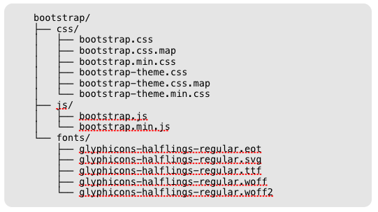
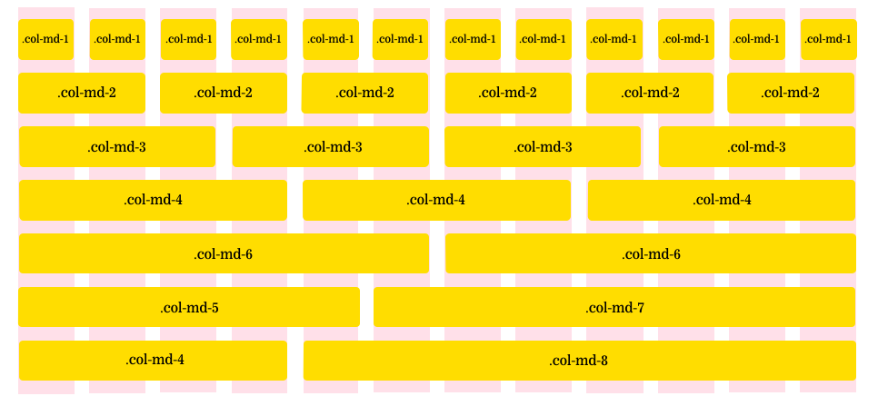

# CSS Frameworks

### Learning Objectives

* Describe the benefits of using responsive design
* Describe what it means to go mobile first
* Explain how a grid system works
* Implement class-based CSS
* Create a responsive layout that adjusts according to the screen/window size

## What is Responsive Design?

"Responsive web design (RWD) is an approach to web design aimed at crafting sites to provide an optimal viewing and interaction experience— easy reading and navigation with a minimum of resizing, panning, and scrolling—across a wide range of devices (from desktop computer monitors to laptops to cellphones).

A site designed with RWD adapts the layout to the viewing environment by using fluid, proportion-based grids, flexible images, etc..."

Source: [Wikipedia](https://en.wikipedia.org/wiki/Responsive_web_design)


**Find an example of responsive design on the web!**

## Grids
### Why use a CSS grid?

#### Structure
* Grids are a simple way to apply layout to a webpage. A better layout improves the user experience.
* Grids help avoid stressful CSS debugging by starting out on the right foot.

#### Reusability
* Grids make the layout process easier because of reusable, semantically-named "utility classes" (i.e., a library of CSS class selectors).
* Grids aren't limited to a particular project. We can apply them to pretty much everything we do.
* Grids are highly customizable. You can really make them your own.

_Even if you don't use a grid system, these concepts will translate across other layout problems._

### Basic components of a grid

#### Rows
* The highest-level component of a grid.
* Comprised of columns.

#### Columns
* Contain and separate site content.

#### Gutters
* Provides spacing between our columns. Optional, but useful.

## What is Class-based CSS?

Create modular classes that *encapsulate* a certain behavior and name them semantically.

How would you style CSS for these elements?

* `.shout` —  make all of the characters uppercase in the element's text
* `.shadow` — add a drop-shadow to text inside the element
* `.invert` — flip an element upside-down

<details><summary>Example solution</summary>

```css
.shout {
	text-transform: uppercase;
}

.shadow {
	text-shadow: 1px 1px 2px black;
}

.invert {
	transform: rotate(180deg);
}
```

</details>

## Bootstrap

Many workplaces use an extablished grid system, such as [Bootstrap](http://getbootstrap.com/) or [Foundation](http://foundation.zurb.com/).

Bootstrap is a **library of CSS classes** that helps make any old site look nice with very little effort. It comes with a **grid system** that makes laying out content on a variety of screen sizes much easier to deal with. Proficiency in at least one CSS framework allows you to make better first impressions when people land on your page.

Features:

1. Grid system
1. Forms/buttons
1. Navigation
1. Tabs and pills
1. Alerts/error messages
1. Modals
1. And much more

Today we will be taking a look at the grid system that Bootstrap provides. 

Take a look at the [Bootstrap Expo](http://expo.getbootstrap.com/) site to see some examples of sites that use Bootstrap.

#### Setup

To add Bootstrap to a project:

1. Download Bootstrap [here](http://getbootstrap.com/customize/)
2. Once downloaded, unzip and open folder in Finder. You’ll see something like this:
	
	
3. Move the `bootstrap.css` file (and any other files you want to use) into the `css` folder in your project
4. Add a `<link>` tag in the head of your page to include the file:
	`<link rel="stylesheet" href="css/bootstrap.min">`
		

#### How it works

Bootstrap includes a responsive, mobile-first fluid grid system that appropriately scales up to 12 columns as the device or viewport size increases.

Page layouts are created through a series of rows and columns that house your content.

Similar to the grid system we created together in class, Bootstrap includes predefined classes for easy layout options:



#### Steps to use Bootstrap

1. Bootstrap requires a containing element to wrap site contents and house our grid system. You may choose one of two containers to use in your projects:
	- Use `.container` for a responsive fixed width container.
	
		```css
		<div class="container">
			...
		</div>
		```
	- Use `.container-fluid` for a full width container, spanning the entire width of your viewport.

		```css
		<div class="container-fluid">
		  ...
		</div>
		```
2. Add rows
	- Use rows to create horizontal groups of columns.
	- Only columns may be immediate children of rows.
	
	```css
	<div class="container-fluid">
		<div class="row">
			(columns)
		</div>
	</div>
	```
3. Add columns
	
	```css
	<div class="container-fluid">
		<div class="row">
		  <div class="col-md-5">.col-md-5</div>
		  <div class="col-md-7">.col-md-7</div>
		</div>
		<div class="row">
		  <div class="col-md-4">.col-md-4</div>
		  <div class="col-md-4">.col-md-4</div>
		  <div class="col-md-4">.col-md-4</div>
		</div>
	</div>
	```

#### Independent Practice

Open [starter-code/bootstrap](starter-code/bootstrap) in your text editor. 

1. Take a look at grid.png.
2. Recreate the grid in your HTML.
	- You should not need to add any CSS!

#### Bootstrap vs. Custom Grid System

Discuss the following question with a partner:

When might it be better to use an established grid system, such as Bootstrap? When might it be better to use a custom-made grid system?
